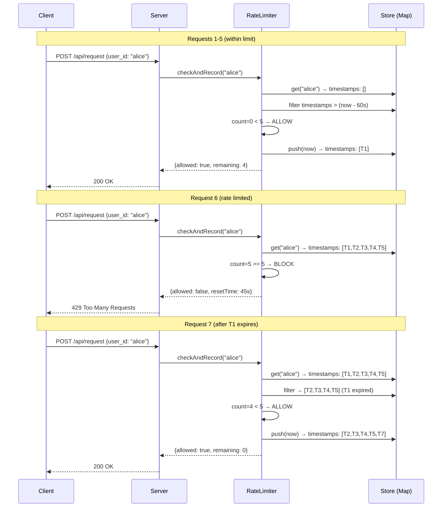

# Rate-Limited API Service

A Next.js backend service implementing rate-limited API endpoints with in-memory storage.

## Features

- **POST /api/request** - Submit requests with user identification
- **GET /api/stats** - View per-user request statistics
- **Rate Limiting** - 5 requests per user per minute (sliding window)
- **Concurrent Request Handling** - Thread-safe operations
- **Standard Rate Limit Headers** - `X-RateLimit-*` headers on all responses

## Getting Started

```bash
npm install
npm run dev
```

Server runs at `http://localhost:3000`

## API

### POST /api/request

```json
// Request
{ "user_id": "user123", "payload": { "any": "data" } }

// Success (200)
{
  "success": true,
  "data": { "user_id": "user123", "payload": {...}, "processed_at": "..." },
  "rateLimit": { "remaining": 4, "resetInSeconds": 60 }
}

// Rate Limited (429)
{
  "error": "Too Many Requests",
  "retryAfter": 45,
  "currentRequests": 5
}
```

### GET /api/stats

```json
{
  "config": { "maxRequestsPerWindow": 5, "windowSeconds": 60 },
  "summary": { "totalUsers": 3, "totalRequests": 15, "totalBlocked": 2 },
  "users": [{ "userId": "user123", "requestsInCurrentWindow": 3, ... }]
}
```

**Headers:** `X-RateLimit-Limit`, `X-RateLimit-Remaining`, `X-RateLimit-Reset`, `Retry-After`

## Testing

```bash
# Submit request
curl -X POST http://localhost:3000/api/request \
  -H "Content-Type: application/json" \
  -d '{"user_id": "test", "payload": {}}'

# Test rate limiting
for i in {1..7}; do
  curl -X POST http://localhost:3000/api/request \
    -H "Content-Type: application/json" \
    -d '{"user_id": "test", "payload": {}}' &
done
wait

# Check stats
curl http://localhost:3000/api/stats
```

---

## Technical Approach

### Algorithm: Sliding Window

| Algorithm          | Pros                         | Cons                          |
| ------------------ | ---------------------------- | ----------------------------- |
| Fixed Window       | Simple, low memory           | Allows 2x burst at boundaries |
| **Sliding Window** | Accurate, no boundary bursts | Slightly more memory          |
| Token Bucket       | Smooth rate limiting         | More complex state            |

**Why Sliding Window?** Prevents boundary burst (5 requests at 0:59 + 5 at 1:01 = 10 in 2s).

```
Timeline:     0    10    20    30    40    50    60    70
              |     |     |     |     |     |     |     |
Request 1   --*------------------------------------------  PASS (0->1)
Request 2   --------*------------------------------------  PASS (1->2)
Request 3   ---------------*-----------------------------  PASS (2->3)
Request 4   ----------------------*----------------------  PASS (3->4)
Request 5   -------------------------------*-------------  PASS (4->5)
Request 6   ------------------------------------------*--  BLOCKED
Request 7   ---------------------------------------------*  PASS (T=0 expired)
```

### Request Flow Sequence



### Concurrency Handling

Node.js single-threaded event loop = no race conditions with sync operations:

```typescript
checkAndRecord(userId: string): RateLimitResult {
  const record = this.store.get(userId);      // sync
  record.timestamps = record.timestamps.filter(...);  // sync
  const allowed = currentRequests < this.maxRequests; // sync
  if (allowed) record.timestamps.push(now);   // sync - no await = atomic
  return result;
}
```

### Architecture

```
API Routes → DTOs → Services → Models
     │         │         │         │
  HTTP I/O  Validate  Business   Types
```

```
app/
├── api/
│   ├── request/route.ts    # POST endpoint
│   └── stats/route.ts      # GET endpoint
├── dto/
│   ├── request.dto.ts      # Request validation
│   └── response.dto.ts     # Response types
├── models/
│   ├── rate-limit.model.ts
│   └── user.model.ts
└── services/
    └── rate-limiter.service.ts  # Singleton, in-memory store
```

---

## Limitations

### Current Implementation Constraints

| Limitation              | Impact                                                                                | Severity | Production Fix            |
| ----------------------- | ------------------------------------------------------------------------------------- | -------- | ------------------------- |
| **In-memory storage**   | All rate limit state lost on server restart                                           | High     | Redis/Memcached           |
| **Single process only** | Each server instance has independent limits; user can exceed limits via load balancer | Critical | Redis + Lua scripts       |
| **No authentication**   | `user_id` trusted from request body; easily spoofed                                   | High     | NextAuth/JWT/API keys     |
| **Memory growth**       | Each unique user consumes memory indefinitely                                         | Medium   | TTL-based eviction, Redis |
| **No request queuing**  | Excess requests rejected immediately (429)                                            | Low      | Bull/BullMQ queue         |
| **Fixed rate limits**   | Same limit for all users (5/min)                                                      | Low      | Tiered limits, DB config  |

### Detailed Explanation

**1. State Persistence**

```
Server restart → Map cleared → All users get fresh 5 requests
```

Users could abuse this by timing requests around deployments.

**2. Horizontal Scaling Problem**

```
Load Balancer
    |-- Server A: user123 -> 5 requests (allowed)
    |-- Server B: user123 -> 5 requests (allowed)
                           = 10 total (limit bypassed)
```

**3. Spoofable User ID**

```bash
# Attacker rotates user_id to bypass limits
curl -d '{"user_id": "fake-1", ...}' /api/request
curl -d '{"user_id": "fake-2", ...}' /api/request
# Unlimited requests
```

**4. Memory Considerations**

```
1 user ≈ 200 bytes (userId + 5 timestamps + counters)
1M users ≈ 200MB RAM
No automatic eviction of inactive users
```

**5. No Graceful Degradation**

- Rejected requests return 429 immediately
- No queuing or retry-later mechanism
- Client must implement retry logic

### What This Solution IS Good For

- Single-instance deployments
- Development/staging environments
- Low-traffic APIs (<1000 users)
- Proof of concept / MVP
- Learning rate limiting concepts

### What This Solution Is NOT Good For

- Production with multiple server instances
- High-availability requirements
- APIs with untrusted clients
- High-traffic systems (>10k req/min)

## Improvements with More Time

**High Priority**

- Redis backend for persistence + horizontal scaling
- Authentication (NextAuth, JWT)
- Request queuing instead of rejecting

**Medium Priority**

- Middleware/wrapper for rate limiting (currently in route handler; Edge middleware needs Redis)
- Environment-based configuration
- Prometheus metrics
- Distributed tracing

## Tech Stack

- Next.js 16, TypeScript, Node.js
